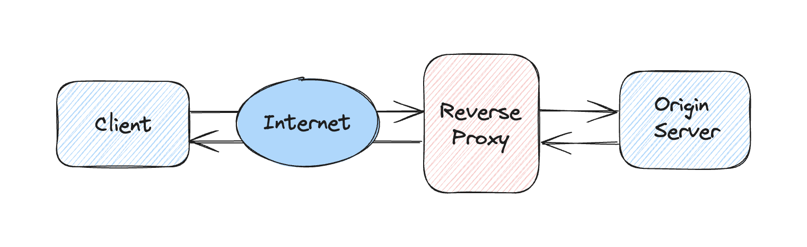

# Reverse Proxy Server in Go

This repository contains a simple implementation of a reverse proxy server in Go.

## Overview

The reverse proxy server listens on a specified address and forwards incoming HTTP requests to a origin server. The responses from the origin server are then sent back to the client.



## Usage

The server can be configured via command-line flags:

- `-address`: The address for the reverse proxy to listen on. Defaults to `127.0.0.1:8080`.
- `-target`: The URL of the origin server to which the proxy should forward requests. Defaults to `https://www.boredapi.com/api/activity`.
- `-timeout`: The timeout for requests to the origin server. Defaults to `10s`.

To start the server, build and run the `main.go` file with your desired flags. For example:

```bash
make build
./reverse-proxy -address 127.0.0.1:8080 -target https://www.boredapi.com/api/activity
```

In a separate terminal, you can then send requests to the server using `curl`:

```bash
curl http://localhost:8080
```

The server will forward the request to the origin server and you should see a response from the origin server similar to the following:

```json
{
  "activity": "Make a bucket list",
  "type": "busywork",
  "participants": 1,
  "price": 0,
  "link": "",
  "key": "2735499",
  "accessibility": 0
}
```

## Graceful Shutdown

The server can be gracefully shut down by sending an interrupt signal (Ctrl+C) or a termination signal (`kill`). When a shutdown signal is received, the server stops accepting new requests and waits for all current requests to finish before it shuts down.

## Hop-by-Hop Headers

Hop-by-hop headers are HTTP headers that are intended for a single transport-level connection and must not be stored by caches or forwarded by proxies, as opposed to end-to-end headers, which are intended for the ultimate recipient of the request.

The server removes the following headers defined as hop-by-hop headers by HTTP/1.1 from the request before forwarding it to the origin server:

- `Connection`
- `Keep-Alive`
- `Proxy-Authenticate`
- `Proxy-Authorization`
- `TE`
- `Trailers`
- `Transfer-Encoding`
- `Upgrade`

## Testing

The server's functionality can be tested by running the provided tests with the `make test` command.

## Linting

The code can be linted with the `make lint` command.

## Limitations

- The reverse proxy server only supports HTTP requests. The origin server can be HTTP or HTTPS.
- The reverse proxy server only supports a single origin server. It does not support load balancing across multiple servers.
- The reverse proxy server does not support WebSocket or other protocols that require persistent connections. In order to add support for WebSocket connections, the server would need to upgrade the connection to a WebSocket connection and then proxy the WebSocket messages between the client and the origin server.
- No support for request rewriting or path mapping. The reverse proxy server simply forwards the request to the origin server without modifying it.

## Future Improvements

### Scaling

1. **Logging**: Add more logging to track the incoming requests and the responses. This can be useful for debugging and monitoring the server's performance.

2. **Metrics**: Collect metrics to monitor the performance of the server, such as the number of requests per minute, the average response time, etc.

3. **Load Balancing**: Implement load balancing to distribute the incoming requests across multiple servers. This can improve performance by reducing the load on each server.

4. **Caching**: Implement caching to store the responses from the origin server. This can improve performance by reducing the number of requests to the origin server.

5. **Rate Limiting**: Implement rate limiting to prevent the server from being overwhelmed by too many requests.

6. **Configuration**: Allow more parameters to be configured to enable more advanced use cases, such as custom rate limiting, caching, etc.

7. **Failure Handling**: Implement resilience to handle failures in the origin server. This can include retrying failed requests, switching to a different server, etc.

8. **Health Checks**: Implement health checks to monitor the health of the origin server. This can be used to detect failures and switch to a different server.

### Security

1. **HTTPS Support**: Add support for HTTPS to encrypt the connection between the client and the server. In order to add support for HTTPS, the server would need to use `http.ListenAndServeTLS` instead of `http.ListenAndServe` and provide a certificate and key.

2. **Authentication**: Implement authentication to prevent unauthorized access to the server.

3. **Authorization**: Implement authorization to restrict access to certain resources on the server.

4. **Input Validation**: Implement input validation to prevent malicious input from being processed by the server.

5. **Rate Limiting**: Implement rate limiting to prevent the server from being overwhelmed by too many requests from malicious clients. This can also help prevent denial-of-service attacks.

## Credits

- The [boredapi](https://www.boredapi.com/) is used as an example origin server for the reverse proxy
- The [diagram](assets/diagram.png) was created using [excalidraw](https://excalidraw.com/)
- https://www.digitalocean.com/community/tutorials/how-to-make-an-http-server-in-go
- The [Go standard library](https://pkg.go.dev/std) was used for reference, especially the [net/http](https://pkg.go.dev/net/http) package
- https://nathandavison.com/blog/abusing-http-hop-by-hop-request-headers
- https://www.cloudflare.com/learning/cdn/glossary/reverse-proxy/
